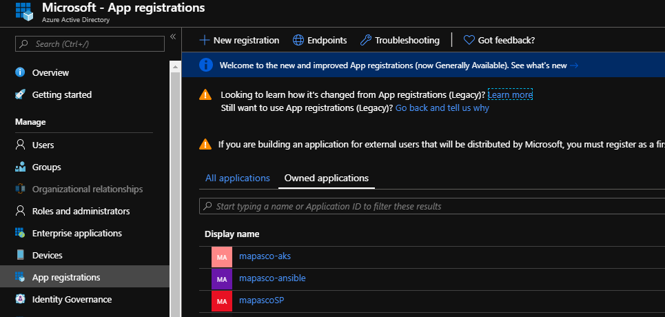
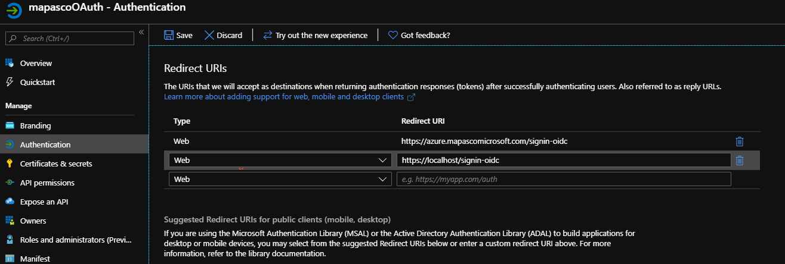
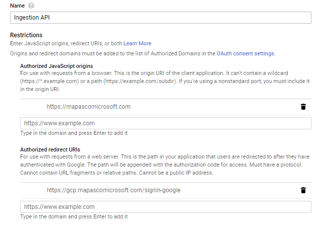

# Ingestion API

This is a lightweight cloud agnostic REST service written in .NET core. 
It accepts file and metadata payloads and stores them in cloud storage for 
later processing in a job queue. The API further provides access to retrieval 
of files in cloud storage.

Current cloud support:

- [x] Azure
- [x] Google Cloud

# API Usage

## Upload
```sh
$ curl -F 'files=@/path/to/file' http://ingestion-api.net/api/upload
```

## Download
```sh
$ curl http://ingestion-api.net/api/download?fileName=<file>
```

## Development Environment Setup

- Install Visual Studio or Visual Studio Code
- Install Docker 
    - [Direct download for mac](https://download.docker.com/mac/stable/Docker.dmg)
    - [Direct download for windows](https://download.docker.com/win/stable/Docker%20Desktop%20Installer.exe)
    - [Instructions for debian/ WSL](https://www.digitalocean.com/community/tutorials/how-to-install-and-use-docker-on-ubuntu-16-04)
- Install `kubectl` (Use `$ az aks install-cli`)

You will also need the appropriate sdk for your target cloud:

- Install `azure-cli` 
    - [Instructions for mac](https://docs.microsoft.com/en-us/cli/azure/install-azure-cli-macos?view=azure-cli-latest)
    - [Instructions for windows](https://docs.microsoft.com/en-us/cli/azure/install-azure-cli-windows?view=azure-cli-latest)
    - [Instructions for linux/WSL](https://docs.microsoft.com/en-us/cli/azure/install-azure-cli-apt?view=azure-cli-latest)

- Install `gcloud sdk` 
    - [Instructions for mac](https://cloud.google.com/sdk/docs/quickstart-macos)
    - [Instructions for windows](https://cloud.google.com/sdk/docs/quickstart-windows)
    - [Instructions for linux/WSL](https://cloud.google.com/sdk/docs/quickstart-linux)
        - Do not install with a package manager, download the binary directly


# Deployment

## Azure

- Create resource group
- Create AKS cluster
- Create ACR repository
- Create keyvault
- Create storage account
- Add role to service principal as both a storage blob contributor and 
storage queue contributor and storage queue data message sender
- Create storage queue
- Configure [oAuth](#user-content-configuring-oauth)
- Login to Azure and ACR using the cli tooling
- Build and tag the image
- Push the image to ACR

## Google Cloud

- Create GCP Project
- Create GKE cluster
- Create GCR Repository
- Create Pub/Sub Topic and Subscription
- Create a Storage Bucket
- Create a service account with permissions to create pub/sub messages and 
upload/download to storage bucket
- Register a webapp with GCP for [oAuth](#user-content-configuring-oauth)
- Login to GCR with docker
- Build and tag the image
- Push image to GCR

# Configuring oAuth

## Azure

### Step 1: Register the sample with your Azure AD tenant

#### Choose the Azure AD tenant where you want to create your applications

1. Sign in to the [Azure portal](https://portal.azure.com) using either a 
work or school account or a personal Microsoft account.
2. If your account is present in more than one Azure AD tenant, select your 
profile at the top right corner in the menu on top of the page, and 
then **switch directory**.
   Change your portal session to the desired Azure AD tenant.

#### Register the webApp (WebApp)

1. Navigate to the Microsoft identity platform for developers 
[App registrations](https://go.microsoft.com/fwlink/?linkid=2083908) page.
  - 
2. Select **New registration**.
3. In **App registrations (Preview)** page, select **New registration**.
4. When the **Register an application page** appears, 
enter your application's registration information:
   - In the **Name** section, enter a meaningful application name that will be 
   displayed to users of the app, for example `WebApp`.
   - In the **Supported account types** section, select 
   **Accounts in any organizational directory and personal Microsoft accounts 
(e.g. Skype, Xbox, Outlook.com)**.
   - In the Redirect URI (optional) section, select **Web** in the combo-box.
   - For the *Redirect URI*, enter the base URL for the sample. By default, 
   this sample uses `https://localhost:5001/`.
   - Select **Register** to create the application.
5. On the app **Overview** page, find the **Application (client) ID** value and 
record it for later. You'll need it to configure the Visual Studio configuration
 file for this project.
6. In the list of pages for the app, select **Authentication**.
   - In the **Redirect URIs**, add a redirect URL of type Web and valued 
   `https://localhost:5001/signin-oidc`
   - In the **Advanced settings** section set **Logout URL** to 
   `https://localhost:5001/signout-oidc`
   - In the **Advanced settings** | **Implicit grant** section, check 
   **ID tokens** as this sample requires the 
   [Implicit grant flow](https://docs.microsoft.com/azure/active-directory/develop/v2-oauth2-implicit-grant-flow) 
   to be enabled to sign-in the user.
   - Select **Save**.

   - 

### Step 2: Add webApp ID's to your solution
  Option 1. In the **appsettings.json** file:
  
  - replace the `ClientID` value with the *Application ID* from the application 
  you registered in Application Registration portal on *Step 1*.
  - replace the `TenantId` value with your Azure *Tenant ID*

  Option 2. In **Environment Variables**:
  - `export AzureAd__ClientId=''` with the value of the *Application ID* from 
  the application you registered in Application Registration portal on *Step 1*.
  - `export AzureAd__TenantId=''` with the value of your Azure *Tenant ID*


## GCP
### Step 1
1. Create an app [here](https://console.developers.google.com/apis/credentials)
    - 
2. Create credentials -> Create OAuth client ID
    - Select webapp
    - Name it
    - Set Redirect URL to 	https://localhost:5001/signin-google
    - 
3. Copy Client Secret and Client ID

### Step 2
1. In the **secrets.json** file:
    - replace `GoogleAuthenticationClientId` value with the *Client ID* from 
    google
    - replace `GoogleAuthenticationClientSecret` value with the *Client secret* 
    from google
    
**-or-**

2. Setting **Environment variables**:
    - `export GoogleAuthenticationClientId=''` value with the *Client ID* from 
    google
    - `export GoogleAuthenticationClientSecret=''` 
    value with the *Client Secret* from google

# Application Configuration
**IMPORTANT** 

For the Ingestion API to work properly, it must be configured with values for 
resources (e.g., Azure Queue). To configure these, follow the documentation 
[here](../docs/application-configuration.md). 

# Running Locally
## Non-Docker
In this directory run:

```sh
$ export DISABLE_OAUTH_FOR_CI="True"
$ dotnet build
$ dotnet run
```

## Docker

In the parent directory: 
### Build the image
```sh
$ docker build -t ingestion-api . -f IngestionApi/Dockerfile --target=runtime
```

### Run the image
```sh
$ docker run ingestion-api
```

More information on running locally can be found [here](../docs/running-locally.md).

# Debugging

## .NET (non docker)
In VS Code:

1. Open this directory
2. Select *Debug->Start Debugging*
    - *(if not already configured)*
    - Select *.NET core*
    - Select the *IngestionApi.csproj*
5. A browser will launch, any breakpoints will now be triggered

## Docker

1. Install the docker extension for VS Code
2. Build and run the *ingestion-api* as detailed above 
3. In the VS Code Docker extension
    - Select the running container
    - Right-click and attach VS Code

# Testing

## Unit Testing

### Ingestion API Unit Test
This runs 4 tests:

1. Uploads a file and verifies the file was uploaded and queued for processing
2. Fails to upload a file and verifies that it failed
3. Downloads a file and verifies the download was sucessful
4. Fails to download a file and verifies the download failed

*Running*
```sh
$ dotnet test IngestionApi/test/UnitTest.IngestionApi
```
### Message Processor Unit Test

For more information on the Message Processor Unit Tests see 
[here](../MessageProcessor/README.md).

*Running*
```sh
$ dotnet test MessageProcessor/test/UnitTest.MessageProcessor
```

## Integration Tests
In order to run Integration Tests, both the `Ingestion Api` and the `Message 
Processor` must be running.

1. Intialize [App settings](#Application-Configuration)
2. Run the Message Processor
	- See [here]() on how to run. 
3. Run the Integration Test
```sh
# 2. Run the Message Processor
$ dotnet run MessageProcessor
# 3. Run the IntegrationTest
$ dotnet test IngestionApi/test/IntegrationTest.IngestionApi
``` 
## Fixing Failed Tests
When a test with multiple tests fail, the failed tests will show up in red.
Tests fails on `assert(...)` statements. To fix the error, tests can be 
debugged individually and the failed assertion should be logged with the exact 
line number. A good starting point is to traceback the failed assertion value.

# Cheat Sheet
### Push the image
```sh
$ docker push your_acr.azurecr.io/ingestion-api
```

### Apply the Kubernetes rules to AKS
```sh
$ kubectl apply -f ingestion-api/aks-deploy.yaml && \
  kubectl apply -f ingestion-api/aks-service.yaml
# Monitor progress
$ kubectl get service ingestion-api --watch
```
