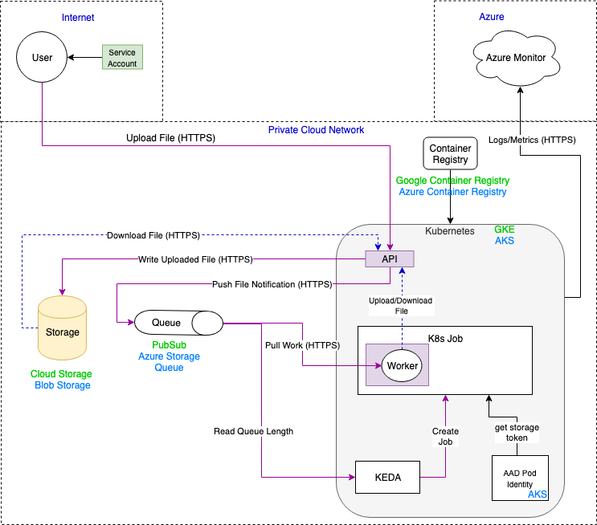

<p>A multi-cloud message processor.</p>

## Table of Contents

- [Introduction](#introduction)
- [Dependencies](#dependencies)
- [Pieces](#pieces)
- [Building](#building)
- [Running Locally](#running-locally)
- [Deploying](#deploying)
- [Contributing](#contributing)

## Introduction



Mercury is a reference implementation of a multi-cloud queue processing service 
which utilizes the following technologies:

1. Cloud PaaS Queues
2. Cloud PaaS Storage
3. Kubernetes
4. [KEDA](https://github.com/kedacore/keda)
5. OAUTH 2.0 and Open Identity

Mercury abstracts the cloud-specific implementation with a user-accessible API. 
This API provides a consistent interface for users regardless of the cloud the 
solution is running on, and currently supports Azure and Google Cloud Platform.

**Mercury is a baseline implementation which should be forked and customized 
to fit your specific needs.**

## Dependencies

* [git](https://git-scm.com/)
* [docker](https://docker.com)
* [docker-compose](https://docs.docker.com/compose/install/)
* [terraform](https://terraform.io)
* [helm](https://helm.sh/)
* [kubernetes](https://kubernetes.io/)
* [kubectl](https://kubernetes.io/docs/reference/kubectl/overview/)
* [aad pod identity](https://github.com/Azure/aad-pod-identity)
* [az-cli](https://docs.microsoft.com/en-us/cli/azure/install-azure-cli?view=azure-cli-latest)
* [gcloud](https://cloud.google.com/sdk/gcloud/)


## Pieces
### Managed Identities
This solution uses managed identities to authenticate and access PaaS resources.
 This eliminates the security risk of storing PaaS keys. 
To set up managed identities see [here](./docs/managed-identities.md).

### Application Configuration
**IMPORTANT** 

For the Ingestion API to work properly, it must be configured with values for 
resources (e.g., Azure Queue). To configure these, follow the documentation 
[here](./docs/application-configuration.md). 


### Ingestion API
This is a lightweight cloud agnostic REST service written in .NET core. 
It accepts file and metadata payloads and stores them in cloud storage for later
 processing in a job queue. 
The API further provides access to retrieval of files in cloud storage.

The full README can be found [here](./IngestionApi/README.md).

### Message Processor
The Message Processor is a lightweight cloud agnostic service written in .NET
Core. The Message Processor watches a queue (e.g., Azure Storage Queue, GCP 
Pub/Sub subscription), when a new item arrives, the Message Processor, reads
the message contents, downloads the correlated file, and performs a pre-defined,
task on the file. Currently, when a file is downloaded, the Message Processor
only uploads an acknowledgment file (`NotifyReceived.txt`) to the cloud 
agnostic storage, however, this application is designed to be higly 
customizable.

The Message Processor is currently used in coordination with 
[KEDA](./KEDA/README.md). KEDA is a Kubernetes Event Driven Autoscaler, which
is used to automatically auto-scale when an event happens. In this scenario,
when a new item is added to the queue.

The full README can be found [here](./MessageProcessor/README.md).

### KEDA
KEDA allows for fine grained autoscaling (including to/from zero) for event 
driven Kubernetes workloads.  KEDA serves as a Kubernetes Metrics Server and 
allows users to define autoscaling rules using a dedicated Kubernetes custom 
resource definition.

KEDA can run on both the cloud and the edge, integrates natively with Kubernetes 
components such as the Horizontal Pod Autoscaler, and has no external 
dependencies.

The full README can be found [here](./KEDA/README.md).

## Building

```bash
docker-compose build
```

## Running Locally

The steps to run the solution locally for development can be found 
[here](docs/running-locally.md)

## Deploying

### Build and Deployment Pipelines
The Jenkins pipeline that builds and deploys the infrastructure and application
for this solution is described [here](docs/pipelines.md)

### Infrastructure Deployment
Infrastructure is deployed using Terraform. 
Instructions to deploy can be found [here](Terraform/README.md).

## Contributing

Pull requests and issues are appreciated.

This project has adopted the 
[Microsoft Open Source Code of Conduct](https://opensource.microsoft.com/codeofconduct/).
For more information see the 
[Code of Conduct FAQ](https://opensource.microsoft.com/codeofconduct/faq/) 
or contact [opencode@microsoft.com](mailto:opencode@microsoft.com) 
with any additional questions or comments.
