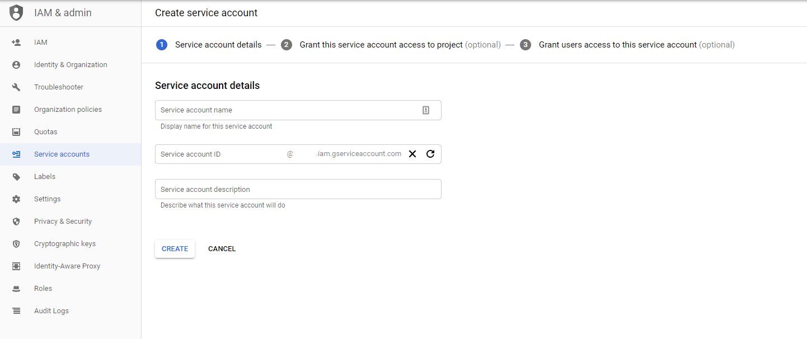

# Configuring Managed Identities

Instead of passing keys and secrets for PaaS resouces, we use the notion of 
managed identies. Managed Identities operate on behalf of the user and have RBAC
 access configured for PaaS resources.

## Azure Managed Service Identities
Azure Service Principals are a special type of active directory account which is
 used for on-behalf-of access to restricted resources. These service principals 
are also known as Managed Service Identities (MSI).

### Locally
When running locally the Managed Service Identity is the current user configured
 via `az cli`

First time configuration

```sh
$ az login
```

Reconfiguration
```sh
# Show the current MSI
$ az account show
# list current accounts
$ az account list
# Set the MSI for specific tenant
$ az account set <id>
```
### Kubernetes (AAD Pod Identities)

When deploying to Kuberenetes, 
[Azure Active Directory (AAD) Pod Identities](https://github.com/Azure/aad-pod-identity) 
are used. This is configured as a Custom Resource Defition (CRD) in Kubernetes. 
This is configured [here](../charts/aad-pod-identity).


### Configuring an Azure Service Principal for Managed Service Identities
```shell
$ az ad sp create-for-rbac --name <ServicePrincipalName>
```

Output
```json
{
    "appId": "XXXXXXXX-XXXX-XXXX-XXXX-XXXXXXXXXXXX",
    "displayName": "ServicePrincipalName",
    "name": "http://ServicePrincipalName",
    "password": "XXXXXXXX-XXXX-XXXX-XXXX-XXXXXXXXXXXX",
    "tenant": "XXXXXXXX-XXXX-XXXX-XXXX-XXXXXXXXXXXX"                                                                                                                            
}                                                                                                                                                               
```
Remember this password, you will have to reset if you forget. 
This is your client secret


### To get service principal info
```sh
$ az ad sp list --display-name ServicePrincipalName --query '[].{"appId":"appId", "objectId":"objectId"}'
```

### Lost Service Principal Password (client secret)
```sh
$ az ad sp credential reset --name <ServicePrincipalName>
```
or
```sh
$ az ad sp credential reset --name <appId>
```

### Adding Roles to a Service Principal
1. Select your PaaS resource (e.g., blob storage) and select Access Control 
(IAM). 
2. Click + Add at the top and select the roles
3. Select your Service Principal and the roles required
    - Blob Storage contributor
    - Queue Contributor


## Google Service Account
Google Service Accounts are akin to Azure Active Directory Service Principals 
and must be configured for the Ingestion API to gain access to PaaS resources.

### Google Application Credentials
**NOTE: You must set the google application credentials environment variable, unless running on GKE**

1. Create a service account in GCP
    - Go to https://console.developers.google.com/iam-admin/iam?project=[YOUR-PROJECT-ID]
    - Navigate to Service Accounts
    - Create Service Account and create a Key (JSON format)
    - 
2. Set Roles for the Service account
    - 
3. Download the JSON key from the GCP console and store locally (not in git)
4. Set the `GOOGLE_APPLICATION_CREDENTIALS` environement variable (shown below)


### Bash
```sh
$ export GOOGLE_APPLICATION_CREDENTIALS="<path to JSON file>"
```

### Powershell
```powershell
> $env:GOOGLE_APPLICATION_CREDENTIALS="<path to JSON file>"
```