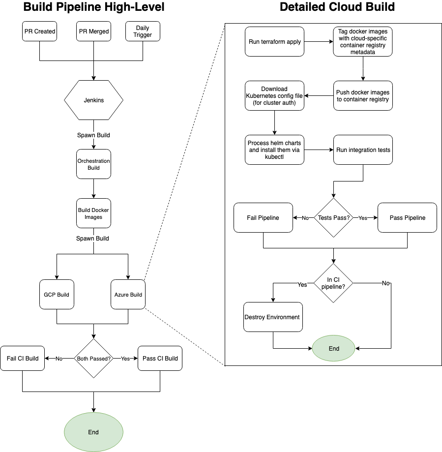

# Pipelines

## Overview
The process of deploying Mercury to the different clouds is described in the 
Jenkinsfiles.

* Root Jenkinsfile: [link](../Jenkinsfile)
* Azure Jenkinsfile: [link](../build/azure/Jenkinsfile)
* GCP Jenkinsfile: [link](../build/gcp/Jenkinsfile)

Each cloud pipeline is composed of a set of shell scripts which accomplish the
following steps:

1. [Docker Build](#Docker-Build)
2. [Terraform Apply](#Terraform-Apply)
3. [Docker Push](#Docker-Push)
4. [Get Kubeconfig](#Get-Kubeconfig)
5. [Deploy to Kubernetes](#Deploy-to-Kubernetes)
6. [Run Integration Tests](#Run-Integration-Tests)
7. [Docker Cleanup](#Docker-Cleanup)
8. [Terraform Destroy](#Terraform-Destroy)

## Scripts
Some scripts are shared across multiple clouds, while some are cloud specific.
These scripts live under:

* build/scripts
* deploy/common/scripts
* deploy/azure/scripts
* deploy/gcp/scripts

Each script documents the environment variables that must be set before being
called, and verifies that they are set. If one is unset, the script will fail
with `<Variable Name>: parameter not set`.

## Pipeline Steps

### Docker Build

**Common link:** [dockerbuild.sh](../build/scripts/dockerbuild.sh)  

**Purpose:**  
This step is a common step shared across all pipelines and exists
in the root Jenkinsfile. In this step, all docker images that are needed for
the solution are built with a generic tag, not tied to any specific cloud registry.
The build of each image also includes running unit tests.

This step is run as the first step of the build so application build failures
are caught early rather than after all the cloud infrastructure has been
deployed.

**Outcome:**  
At the end of this step, a set of docker images will exist on the build
machine. These scripts will have a generic tag.

### Terraform Apply

**Azure link:** [terraformapply.sh](../deploy/azure/scripts/terraformapply.sh)  
**GCP link:** [terraformapply.sh](../deploy/gcp/scripts/terraformapply.sh)  

**Purpose:**  
This step's purpose is to call Terraform to create the cloud
infrastructure that is needed to run this solution. Because each cloud has its
own Terraform scripts which require different parameters, there is a seperate
script to handle calling Terraform for each cloud.

**Outcome:**  
At the end of this step, all cloud resources will be created with the correct
permissions set for each.

### Docker Push

**Azure link:** [dockerpush.sh](../deploy/azure/scripts/dockerpush.sh)  
**GCP link:** [dockerpush.sh](../deploy/gcp/scripts/dockerpush.sh)  

**Purpose:**  
This step exists to accomplish three things:

1. Tag the previously build docker images with the container registry uri.
2. Log into the cloud-speicific container registry.
3. Push the tagged docker images to the cloud-specific container registry.

Since each cloud has its own authentication mechanism, there is a separate
script for handling the push to each cloud.

**Outcome:**  
At the end of this step, the cloud registry will contain a copy of the docker
image that was built as part of the pipeline.

### Get Kubeconfig

**Azure link:** [getkubeconfig.sh](../deploy/azure/scripts/getkubeconfig.sh)  
**GCP link:** [getkubeconfig.sh](../deploy/gcp/scripts/getkubeconfig.sh)  

**Purpose:**  
This step exists to download the Kubernetes configuration file for the cluster
deployed by Terraform. This configuration file is used by the `kubectl` command
to authenticate to the cluster.

Since each cloud has its own mechanism for downloading the kubeconfig files,
there is a seperate script for each cloud.

**Outcome:**  
At the end of this step, the kubeconfig file will be downloaded to the build
machine.

### Deploy to Kubernetes

**Azure link:** [deploytokubernetes.sh](../deploy/azure/scripts/deploytokubernetes.sh)  
**GCP link:** [deploytokubernetes.sh](../deploy/gcp/scripts/deploytokubernetes.sh)  

**Purpose:**  
This step exists to push the Kubernetes configuration (generated by helm) to
the previously deployed Kubernetes cluster. In some cases, this will also
be used to inject secrets into Kubernetes.

Since each cloud has unique parameters that are passed into the Helm chart, and
GCP needs a secret injected while Azure relies on managed identities, there is
a seperate script for each cloud.

**Outcome:**  
At the end of this step, the kubernetes configuration will be pushed to the
cluster and the Kubernetes resources (including Deployments managing
containers) will be deployed to the cluster.

### Run Integration Tests

**Common link:** [integrationtest.sh](../deploy/common/scripts/integrationtest.sh)   

**Purpose:**  
This step exists to run the integration tests against the service deployed to
Kubernetes. The script runs the tests from within a Docker container and targets
the public endpoint created by Kubernetes.

**Outcome:**  
At the end of this step, integration tests will have be run against the
deployed solution and either passed or failed.

### Docker Cleanup

**Common link:** [dockercleanup.sh](../build/scripts/dockercleanup.sh)  

**Purpose:**  
This step is a common step shared across all pipelines and exists
in the root Jenkinsfile. In this step, all docker images that have been built
as part of this pipeline will be cleaned up. Not doing this will result in
a build up of images that may fill up the entire hard disk on the build
machine. 

**Outcome:**  
At the end of this step, any built Docker images will be removed from the local
build machine.

### Terraform Destroy

**Azure link:** [terraformdestroy.sh](../deploy/azure/scripts/terraformdestroy.sh)  
**GCP link:** [terraformdestroy.sh](../deploy/gcp/scripts/terraformdestroy.sh)  

**Purpose:**  
This step's purpose is to call Terraform to destroy the cloud
infrastructure that was deployed to run this solution. Because each cloud has
its own Terraform scripts which require different parameters, there is a
seperate script to handle calling Terraform destroy for each cloud.

Note: This step should only be run as part of a CI pipeline where there is no
expectation of a long-running deployment existing. For a CD pipeline, this step
should be skipped to avoid deleting an environment which is serving traffic.

**Outcome:**  
At the end of this step, all cloud resources that were previously created by 
Terraform as part of `terraform apply`, will be deleted and any configuration
changes made by Terraform will be undone.